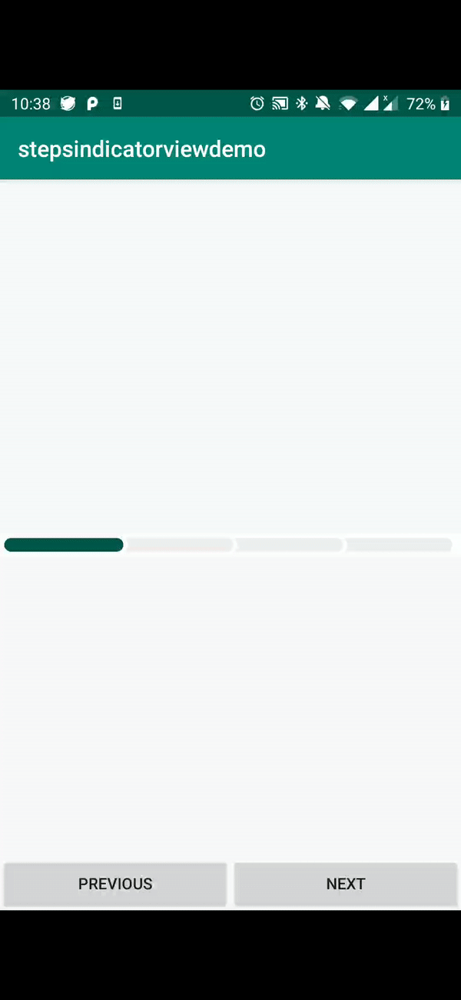

# StepsIndicatorView
Steps indicator view library



## Development
``` gradle
implementation 'au.com.appetiser.baseplate:stepsindicatorview:0.0.2'
```

## How to use
``` xml
<com.appetiser.stepsindicatorview.StepsIndicatorView
    android:id="@+id/indicatorContainer"
    android:layout_width="0dp"
    android:layout_height="wrap_content"
    android:layout_marginTop="16dp"
    app:dividerColor="@color/white"
    app:layout_constraintEnd_toStartOf="@+id/rightGuideLine"
    app:layout_constraintStart_toStartOf="@+id/leftGuideLine"
    app:layout_constraintTop_toBottomOf="@+id/title"
    app:siv_backgroundColor="@color/white"
    app:siv_height="16"
    app:siv_progressColor="@color/cerulean_blue"
    app:siv_progressCount="1"
    app:siv_progressEmptyColor="@color/solitude"
    app:siv_totalProgressCount="4" />
```

### Attributes
- `siv_backgroundColor` - Sets the background color of the steps indicator view. This is used to match your screen's background.
- `siv_height` - Height of steps indicator view in pixels.
- `siv_progressColor` - Active steps color.
- `siv_progressEmptyColor` - Inactive steps color.
- `siv_progressCount` - Sets the number of steps active.
- `siv_totalProgressCount` - Sets the total number of steps.

### Public methods
- `animateNext()` - Increases number of steps by 1 and provides animation.
- `animateBack()` - Decreases number of steps by 1 and provides animation.

